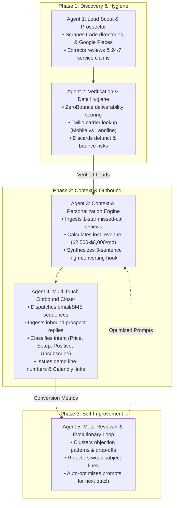

# Project 1.1: Autonomous 5-Agent Outbound Sales & Closer Swarm

> **Domain / Target Offer:** Autonomous customer acquisition engine for **SkillsVital Voice AI Receptionist** (`https://skillsvital.com/voice`) targeting local trade contractors (Plumbing, HVAC, Roofing, Electrical) to eliminate missed after-hours calls.  
> **Core Architecture:** 5-Agent LangGraph Swarm with State Persistence, Real-Time Intent Classifier, and Evolutionary Meta-Prompting.  
> **AI Engine:** Provider-Agnostic Universal LLM (`Claude 3.5 Sonnet` / `Gemini 2.0 Flash` / `$0 Deterministic Sandbox`).

---

## Architecture Diagram



---

## The 5 Autonomous Agent Roles

| Agent | Name | Responsibility | Tooling / Logic |
| :--- | :--- | :--- | :--- |
| **Agent 1** | **Lead Scout** | Scrapes contractors, owner names, phone, website, and Google/Yelp reviews. | Google Places parser, Yelp Review extractor. |
| **Agent 2** | **Verification Sentry** | Validates email deliverability and mobile vs. landline carrier types; discards bounce traps. | ZeroBounce & Twilio Lookup pattern. |
| **Agent 3** | **Hook Personalizer** | Parses specific customer reviews ("voicemail was full on Sunday") and calculates lost revenue. | Claude 3.5 Sonnet / Gemini 2.0 Flash structured JSON. |
| **Agent 4** | **Autonomous Closer** | Dispatches outreach, ingests inbound replies in real time, addresses objections, and delivers live demo line. | LangGraph state machine, Smartlead / Twilio webhook listener. |
| **Agent 5** | **Meta-Reviewer** | Analyzes weekly metrics, detects friction points, and refactors prompt parameters and subject lines. | Evolutionary prompt optimization. |

---

## Directory Structure

```
project-1.1-autonomous-sales-swarm/
├── README.md                      # Architecture & execution guide
├── requirements.txt               # Dependencies
├── .env.example                   # Provider credentials (Gemini, Claude, Sandbox)
├── config.py                      # Environment & offer settings
├── core/
│   ├── schemas.py                # Strict Pydantic data models
│   ├── llm.py                    # Universal AI-Agnostic LLM Client
│   ├── database.py               # SQLite state persistence & suppression list
│   └── state.py                  # LangGraph 5-agent state graph
├── agents/
│   ├── scout_agent.py            # Agent 1: Lead Scout
│   ├── verifier_agent.py         # Agent 2: Verification Sentry
│   ├── personalizer_agent.py     # Agent 3: Hook & Lost Revenue Engine
│   ├── closer_agent.py           # Agent 4: Autonomous Objection Closer
│   └── meta_reviewer_agent.py    # Agent 5: Evolutionary Feedback Loop
├── data/
│   ├── sample_leads.json         # Realistic trade contractor fixtures with reviews
│   └── objection_library.json    # Objection handling knowledge base
├── api/
│   └── webhook_server.py         # FastAPI inbound webhook gateway
├── cli.py                         # Rich interactive terminal dashboard
└── tests/
    └── test_swarm.py              # Pytest automated test suite (7 passing tests)
```

---

## Quickstart Guide

### 1. Configure Environment
Copy `.env.example` to `.env`:
```bash
cp .env.example .env
```
*(Default settings use `$0 Sandbox Simulation Mode` with instant deterministic responses and 100% synthetic safe test data. Set `GEMINI_API_KEY` to run against live Gemini 2.0 Flash, or `ANTHROPIC_API_KEY` for Claude).*

---

## Interactive Simulation & Control UI Dashboard

Project 1.1 includes a dedicated web frontend built with **HTML5, CSS3, and JavaScript** located in [`frontend/`](file:///Users/kalmin/startups/claude-spectra/Track%201%20-%20Autonomous%20AI%20Agents%20&%20Business%20Automation/project-1.1-autonomous-sales-swarm/frontend/) to monitor and control the multi-agent swarm in real time.

### 1. Launch the UI Server
```bash
/Users/kalmin/startups/claude-spectra/.venv/bin/uvicorn api.webhook_server:app --reload --port 8000
```
Open **`http://127.0.0.1:8000/`** or **`http://localhost:8000/`** in your browser.

### 2. UI Monitoring & Control Features
- **Zero Real Data Guarantee:** 100% synthetic simulated trade contractors, fictional owner identities, RFC test domains (`@simulated.test`), and reserved NANPA 555-01XX test telephone numbers. No external scraping or real PII.
- **Real-Time Swarm Monitoring:**
  - 5-Agent Architecture visualizer displaying live agent states (`READY`, `ACTIVE`, `DONE`) across Scout, Verifier, Personalizer, Closer, and Meta-Reviewer.
  - KPI cards tracking Scouted Leads, Deliverability %, Outbound Sent, Inbound Replies, Positive Interest, CRM Suppressions, and Demos Triggered.
  - Real-time streaming activity feed logging agent decisions with exact timestamps.
- **Interactive Simulation Controls:**
  - **`Run Full Batch`**: Automatically dispatches all 5 agents end-to-end on synthetic contractor batches.
  - **`Step Agent`**: Manually step the simulation forward by 1 agent transition to inspect intermediate states.
  - **`Custom Parameters`**: Tune Trade Niche (Plumbing, HVAC, Roofing, Electrical), Target Region (Dallas, Phoenix, Denver, Orlando, Austin, Atlanta), and Batch Size (1 to 8 leads).
  - **`Agent 4 Closer Sandbox`**: Select any simulated lead, choose an objection scenario (Price, Complexity, Already Have, Positive Interest, Unsubscribe) or write a custom prospect reply, and watch Agent 4 autonomously classify intent, show reasoning, and formulate a reply.
  - **`Agent 5 Evolutionary Optimization`**: Inspect auto-refactored subject lines, weak outreach patterns, and projected CRO gains.
  - **`Reset`**: One-click database reset to clear records and start a fresh simulation run.

### 3. Run the Interactive Terminal CLI
```bash
/Users/kalmin/startups/claude-spectra/.venv/bin/python3 cli.py
```


---

## How to Record Your $0 Demo Video (2–3 Minutes)

1. **Open Terminal Window:** Make your font clean and large (e.g. Menlo 16pt, dark theme).
2. **Start Screen Recording:** Use Mac Screen Recorder (`Cmd + Shift + 5`) or OBS Studio.
3. **Run `python3 cli.py`:**
   - **0:00 - 0:30:** Introduce the problem: *"Local home service contractors lose thousands of dollars in high-margin emergency jobs when nobody answers after-hours calls. This autonomous 5-agent swarm handles the entire customer acquisition pipeline with zero human intervention."*
   - **0:30 - 1:00:** Highlight Agent 1 & Agent 2: Point out how Agent 1 parsed specific 1-star Yelp reviews about missed calls, and Agent 2 discarded defunct emails to protect sender reputation.
   - **1:00 - 1:45:** Highlight Agent 3 & Agent 4: Show the synthesized 3-sentence email calculating $3,000–$6,000/mo in lost revenue, and watch Agent 4 autonomously classify the price objection and issue our live demo line (`+1-888-548-3782`).
   - **1:45 - 2:15:** Highlight Agent 5: Show the evolutionary loop auto-refactoring subject lines and hook angles for the next batch based on campaign analytics.
   - **2:15 - 2:30:** Conclude with the metrics table showing 100% autonomous operation.
