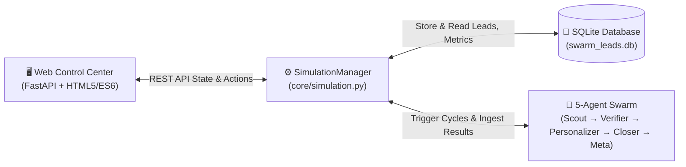
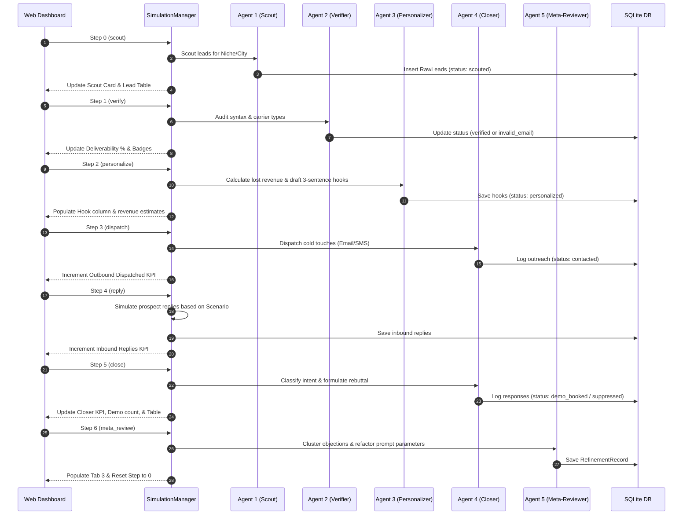

# Project 1.1: Web Simulation & Control Center — Full UI & Phase Specification

> **Target Audience:** Engineers, Stakeholders, Product Operators, and Portfolio Evaluators  
> **Document Purpose:** Complete specification detailing what the Project 1.1 UI does, what each button and control achieves, and how each simulation phase functions under the hood.  
> **Project Directory:** [`Track 1 - Autonomous AI Agents & Business Automation/project-1.1-autonomous-sales-swarm`](file:///Users/kalmin/startups/claude-spectra/Track%201%20-%20Autonomous%20AI%20Agents%20%26%20Business%20Automation/project-1.1-autonomous-sales-swarm)

---

## 1. Executive Summary & UI Mental Model

### What Is This UI?
The **Autonomous Sales Swarm Control Center** is a real-time observability cockpit and simulation harness for a 5-agent outbound voice AI sales organization.

Instead of operating as an opaque, headless command-line script, this UI provides:
1. **Visual Telemetry:** Real-time visibility into the state transitions of 5 specialized AI agents as they process contractor leads.
2. **Safe RFC-Compliant Test Range:** A sandbox that simulates the complete sales pipeline—from prospect discovery to objection handling—with **$0 API/telephony spend** and **zero risk to email sender reputation or real phone numbers**.
3. **Interactive Debugging:** The ability to step through the multi-agent pipeline one phase at a time or stress-test objection handling against custom prospect inputs.

### The Business Mission Simulated
The swarm sells **SkillsVital Voice AI Receptionist** (`https://skillsvital.com/voice`) to local trade contractors (Plumbing, HVAC, Roofing, Electrical). 
- **The Core Problem Solved:** Home service contractors lose $3,000–$6,000/month in high-ticket emergency repair jobs because they miss calls after-hours, on weekends, or while technicians are on ladders.
- **The AI Swarm's Job:** Automatically discover contractors with missed-call reviews, verify contact data, craft tailored ROI pitches, counter objections, and book live voice demos.



---

## 2. UI Layout & Visual Anatomy

The UI is divided into 6 distinct functional zones:

```
┌────────────────────────────────────────────────────────────────────────────────────────┐
│ ⚡ AUTONOMOUS SALES SWARM  [● 100% SIMULATION ENGINE]     [⏭ Step Agent] [▶ Run Full Batch] [🔄 Reset] │
├────────────────────────────────────────────────────────────────────────────────────────┤
│ Simulation Setup: [Trade Niche ▾] [City ▾] [Count ▾] [Scenario ▾] | Pipeline: idle (0/7) │
├────────────────────────────────────────────────────────────────────────────────────────┤
│ [Agent 1: Scout]  [Agent 2: Verifier]  [Agent 3: Personalizer]  [Agent 4: Closer]  [Agent 5: Meta] │
├────────────────────────────────────────────────────────────────────────────────────────┤
│ [Scouted: 0] [Deliverability: 100%] [Outreach: 0] [Replies: 0] [Positives: 0] [Demos: 0]│
├────────────────────────────────────────────────────────────────────────────────────────┤
│ TABS:  [📋 Simulated Leads Pipeline]  [🎯 Closer Sandbox]  [🧬 Evolutionary Loop]  [⚡ Logs] │
│                                                                                        │
│                                                                                        │
│                                  TAB ACTIVE CONTENT                                    │
│                                                                                        │
└────────────────────────────────────────────────────────────────────────────────────────┘
```

---

## 3. Every User Action & Control Explained

### 3.1. Primary Header Actions

| Control / Button | Action Performed | What It Achieves |
| :--- | :--- | :--- |
| **`▶ Run Full Batch`** | Dispatches an automated end-to-end run of all 7 simulation steps across all 5 agents sequentially. | **Complete Workflow Demonstration:** In ~2 seconds, it discovers leads, verifies them, calculates lost revenue, dispatches outbound touches, simulates inbound replies, closes objections, and triggers meta-review optimization. Ideal for demo recordings and quick validation. |
| **`⏭ Step Agent`** | Executes exactly **one** discrete step of the simulation sequence (`scout` $\rightarrow$ `verify` $\rightarrow$ `personalize` $\rightarrow$ `dispatch` $\rightarrow$ `reply` $\rightarrow$ `close` $\rightarrow$ `meta_review`). | **Granular Inspection & Auditing:** Allows an engineer or reviewer to pause at any phase, inspect what a specific agent produced (e.g., examine the raw review extracted by Agent 1, or check the deliverability flags produced by Agent 2) before advancing. |
| **`🔄 Reset`** | Flushes the SQLite database (`swarm_leads.db`), resets metrics counters to zero, clears event logs, and sets the pipeline state back to `idle (Step 0/7)`. | **Clean-Slate Testing:** Allows repeating test runs with different trade niches or objection scenarios without old lead records cluttering tables or metrics. |

---

### 3.2. Simulation Setup Parameters (Control Bar)

Located directly below the header, these controls configure the behavior of the next batch:

1. **`Trade Niche` (Select Dropdown):**
   - *Options:* `Plumbing`, `HVAC`, `Electrical`, `Roofing`
   - *What It Achieves:* Changes the contractor types generated, the trade-specific emergency pain points (e.g., burst pipes for Plumbing, blown compressors during 105°F heat waves for HVAC), and the typical average job ticket value ($450–$3,500).
2. **`City / Region` (Select Dropdown):**
   - *Options:* `Dallas, TX (214)`, `Phoenix, AZ (602)`, `Denver, CO (303)`, `Orlando, FL (407)`, `Austin, TX (512)`, `Atlanta, GA (404)`
   - *What It Achieves:* Configures the local telephone area codes and geographic market context, ensuring realistic local presence.
3. **`Lead Batch Size` (Select Dropdown):**
   - *Options:* `2`, `3`, `5`, or `8` Simulated Leads
   - *What It Achieves:* Dictates the volume of leads processed in the batch. When count $\ge 3$, the system automatically injects realistic deliverability anomalies (e.g., invalid syntax or risky mailboxes) to demonstrate Agent 2's sentry filtering.
4. **`Scenario Archetype` (Select Dropdown):**
   - *Options:*
     - `Balanced Mix`: Alternates between price objections, complexity concerns, positive demo requests, and unsubscribes.
     - `Price Resistance ($497/mo)`: Forces prospects to push back on subscription cost.
     - `Setup Hesitation (No IT)`: Forces prospects to question technical complexity and setup downtime.
     - `High Interest (Demo Link)`: Simulates urgent contractor interest demanding a live voice test.
     - `Unsubscribe Waves`: Tests compliance with immediate opt-out and CRM suppression.
   - *What It Achieves:* Allows targeted validation of Agent 4's intent classifier and rebuttal engine against specific prospect mindsets.

---

### 3.3. Tabbed Workspaces

The UI features 4 primary tabs to provide dedicated views into different subsystems:

#### Tab 1: 📋 Simulated Leads Pipeline
- **What It Does:** Renders a real-time data table of all leads currently in the database.
- **Columns:**
  - `Contractor / Trade`: Company name and industry icon.
  - `Contact (Synthetic)`: Owner name and generated test email.
  - `Location`: City, state, and area-coded test phone.
  - `Hygiene & Carrier`: Verification badge (e.g., `VALID / MOBILE` or `INVALID_SYNTAX`).
  - `Est. Lost Revenue`: Highlighted dollar value calculated by Agent 3 (e.g., `$4,800/mo`).
  - `Current Status`: Dynamic pill badge (`scouted`, `verified`, `contacted`, `objection_handling`, `demo_booked`, `suppressed`).
  - `Action`: **`Inspect`** button.
- **Inspect Action (Detail Drawer / Modal):**
  - Clicking `Inspect` opens a comprehensive inspection modal showing:
    1. The customer review that triggered the outreach (with date and 1-star rating).
    2. The 3-sentence outreach hook generated by Agent 3.
    3. The carrier lookup data and deliverability score.
    4. The full interaction history, including inbound replies and Agent 4's autonomous responses.

#### Tab 2: 🎯 Agent 4 Closer Sandbox
- **What It Does:** An interactive testing laboratory for Agent 4's decision engine.
- **Controls & Actions:**
  - *Target Contractor Dropdown:* Select any contractor from the active batch.
  - *Preset Objection Dropdown:* Select a common trade contractor objection or inquiry.
  - *Message Textarea:* Pre-filled with the preset, or editable to type **any custom prospect reply**.
  - *`Dispatch Inbound Reply & Trigger Closer` Button:*
    - Sends the message to the backend LLM / Intent Classifier.
    - Evaluates intent in real time and updates the decision card on the right.
- **Output Card (Autonomous Decision):**
  - Displays **Detected Intent** (`PRICE`, `COMPLEXITY`, `ALREADY_HAVE`, `POSITIVE_INTEREST`, `UNSUBSCRIBE`, `UNKNOWN`).
  - Displays **Confidence Score** (e.g., `94%`).
  - Displays **Step-by-Step Reasoning** explaining *why* the agent chose this classification.
  - Displays **Action Taken** (e.g., `SEND_DEMO_NUMBER`, `CALENDLY_INVITE`, `SUPPRESS_LEAD`).
  - Displays **Autonomous Outbound Response Sent** containing the exact email copy dispatched back to the contractor.

#### Tab 3: 🧬 Agent 5 Evolutionary Loop
- **What It Does:** Visualizes the meta-learning feedback loop.
- **Controls & Actions:**
  - *`⚡ Run Evolutionary Optimization Now` Button:* Manually triggers Agent 5 to analyze recent batch drop-offs and objection logs.
- **Outputs Displayed:**
  - *Analysis Summary:* High-level assessment of campaign conversion bottlenecks.
  - *Isolated Weak Patterns:* Identified weak phrases (e.g., *"Generic greeting: 'Hope this email finds you well' creates immediate bounce friction"*).
  - *Projected Conversion Gain:* Expected statistical uplift for the subsequent batch (e.g., `+18.4%`).
  - *Auto-Refactored Subject Lines:* 3 new AI-generated cold email subject lines designed to bypass the detected objections.
  - *Adjusted Hook Angles:* New opening sentence templates addressing the specific trade's friction points.

#### Tab 4: ⚡ Real-Time Activity Log
- **What It Does:** A terminal-style streaming event console showing every internal agent call with millisecond timestamps, log severity levels (`info`, `success`, `warning`, `error`), and agent tags.
- **What It Achieves:** Gives developers complete transparency into internal system telemetry during automated batch executions.

---

## 4. The 7 Phases of the Swarm Simulation (Under the Hood)

When running sequentially via `Step Agent` or in automated succession via `Run Full Batch`, the system executes the following 7 distinct phases:



---

### Detailed Breakdown of Each Phase

### Phase 0: Discovery (`scout`)
- **Responsible Agent:** `Agent 1: Lead Scout` (`agents/scout_agent.py`)
- **What Happens:**
  - Generates realistic trade contractor fixtures using RFC test standards (or queries live Google Search Grounding when live mode is active).
  - Pairs each contractor with realistic 1-star reviews specifically referencing **missed emergency calls** (e.g., *"Called on a Sunday evening with a burst pipe... no one answered"*).
  - Checks if the contractor advertises "24/7 Emergency Service" on their website.
- **Database Mutation:** Inserts records into `leads` table with initial status `scouted`.
- **UI Impact:** 
  - `Agent 1` card updates to `ACTIVE` $\rightarrow$ `DONE`.
  - `Scouted Leads` KPI increments.
  - Table fills with new rows.

### Phase 1: Verification & Data Hygiene (`verify`)
- **Responsible Agent:** `Agent 2: Verification Sentry` (`agents/verifier_agent.py`)
- **What Happens:**
  - Executes strict RFC 5322 regex checks on prospect emails.
  - Simulates carrier lookup (distinguishing mobile vs. landline lines).
  - Automatically identifies and filters out deliberate honeypot / invalid email patterns (`invalid-bounce@...`).
- **Database Mutation:** Verified leads transition to `verified`; failed leads transition to `invalid_email` and are suppressed from downstream outreach.
- **UI Impact:**
  - `Agent 2` card transitions to `DONE`.
  - `Deliverability Rate` KPI updates (e.g., 67% or 100%).
  - `Hygiene & Carrier` table column updates with green/red indicator badges.

### Phase 2: Contextual Personalization (`personalize`)
- **Responsible Agent:** `Agent 3: Hook Personalizer` (`agents/personalizer_agent.py`)
- **What Happens:**
  - Analyzes the 1-star review text discovered in Phase 0.
  - Calculates estimated lost revenue based on trade economics:
    $$\text{Lost Revenue} = \text{Average Job Ticket} \times \text{Est. Missed Emergency Calls/Mo}$$
  - Generates a laser-targeted, non-pushy 3-sentence outreach email referencing the exact review and dollar loss.
- **Database Mutation:** Stores the generated subject line, hook body, and dollar valuation; updates status to `personalized`.
- **UI Impact:**
  - `Agent 3` card transitions to `DONE`.
  - Table `Est. Lost Revenue` column populates (e.g., `$5,200/mo`).
  - Clicking `Inspect` now reveals the full personalized outreach hook.

### Phase 3: Outbound Dispatch (`dispatch`)
- **Responsible Agent:** `Agent 4: Autonomous Closer - Outbound Dispatch` (`agents/closer_agent.py`)
- **What Happens:**
  - Dispatches the generated hook through simulated outbound communication channels (Email / SMS gateway).
  - Logs timestamps and sets up tracking webhooks for inbound engagement.
- **Database Mutation:** Updates lead status to `contacted`.
- **UI Impact:**
  - `Agent 4` card transitions to `ACTIVE`.
  - `Outbound Dispatched` KPI increments by batch size.
  - Table status pill turns blue (`contacted`).

### Phase 4: Inbound Prospect Reply Simulation (`reply`)
- **Responsible Component:** `SimulationProspectResponder` (`core/simulation.py`)
- **What Happens:**
  - Simulates the prospect reading the outreach hook and replying.
  - Formulates responses according to the selected **Scenario Archetype** (e.g., *"How much does this cost per month?"* or *"Can I call the demo number right now from my cell?"*).
- **Database Mutation:** Inbound message saved in `inbound_replies` table.
- **UI Impact:**
  - `Inbound Replies` KPI increments.
  - Event log streams prospect message arrival in real time.

### Phase 5: Autonomous Objection Handling (`close`)
- **Responsible Agent:** `Agent 4: Autonomous Closer - Inbound Handling` (`agents/closer_agent.py`)
- **What Happens:**
  - Evaluates the prospect's reply through structured intent classification.
  - **Branches by Intent:**
    - If `PRICE_OBJECTION`: Explains that a single recovered emergency job covers the entire $497/month service cost, and invites them to call the live demo line (`+1-888-548-3782`).
    - If `COMPLEXITY_OBJECTION`: Reassures that setup takes 15 minutes with zero hardware or IT changes (simple conditional call-forwarding).
    - If `POSITIVE_INTEREST`: Immediately provides the live demo line and calendar booking link.
    - If `UNSUBSCRIBE`: Suppresses the lead immediately in the database, ensuring zero further contact.
- **Database Mutation:** Lead status updates to `demo_booked` or `suppressed`.
- **UI Impact:**
  - `Agent 4` card transitions to `DONE`.
  - `Positive Interest`, `Opt-Out / Suppressed`, and `Demos Booked` KPIs increment accordingly.
  - Tab 1 displays the final lead outcome.

### Phase 6: Evolutionary Self-Tuning (`meta_review`)
- **Responsible Agent:** `Agent 5: Meta-Reviewer` (`agents/meta_reviewer_agent.py`)
- **What Happens:**
  - Ingests aggregated metrics across all handled leads.
  - Pinpoints friction points (e.g., if price objections were high, prompts are refactored to emphasize ROI earlier).
  - Synthesizes 3 improved subject lines and refined hook angles for the subsequent batch.
- **Database Mutation:** Writes a new `refinement_records` entry.
- **UI Impact:**
  - `Agent 5` card transitions to `DONE`.
  - Tab 3 (`🧬 Evolutionary Loop`) populates with newly optimized subject lines, weak pattern analyses, and projected conversion uplift.
  - Pipeline resets to `idle (Step 0/7)`, ready for the next campaign iteration.

---

## 5. Summary Mapping: Simulation UI vs. Production System

To understand how this interface translates to a live enterprise deployment:

| Swarm Component | Web Simulation UI Behavior | Live Production Equivalent |
| :--- | :--- | :--- |
| **Lead Discovery** | Synthetic RFC generator with procedural review templates | Google Places API / Yelp Scraper / Apollo.io |
| **Hygiene** | RFC syntax check & carrier pattern detection | ZeroBounce API & Twilio Carrier Lookup API |
| **Personalization** | Universal LLM (Gemini 2.0 Flash / Claude 3.5 Sonnet) | Same LLM, streaming directly into campaign databases |
| **Outbound Dispatch** | Simulated HTTP dispatch logged to local SQLite | Smartlead.ai API (Email) / Twilio API (SMS) |
| **Prospect Reply** | Procedural contractor persona generator | Real inbound email inbox / SMS webhook receiver |
| **Closer Decision** | Intent classification & objection rebuttal engine | Production FastAPI webhook receiving Smartlead webhooks |
| **Feedback Loop** | Auto-refactors prompt parameters in memory | LangSmith / LangGraph automated prompt tuning pipeline |

---

## 6. Quick Verification Checklist

When presenting or reviewing the UI, use this 4-step sequence:
1. **Initial State:** Click `🔄 Reset` to verify a clean dashboard with zeroed counters.
2. **Interactive Stepping:** Click `⏭ Step Agent` three times to watch Agent 1 scout leads, Agent 2 verify deliverability, and Agent 3 generate revenue loss numbers.
3. **Closer Testing:** Switch to **Tab 2 (Closer Sandbox)**, type a tough objection (e.g., *"We already pay an answering service $150/mo, why pay $497?"*), and observe Agent 4's reasoning and counter-argument.
4. **Self-Improvement:** Switch to **Tab 3 (Evolutionary Loop)** to review the auto-refactored subject lines and conversion delta generated by Agent 5.
