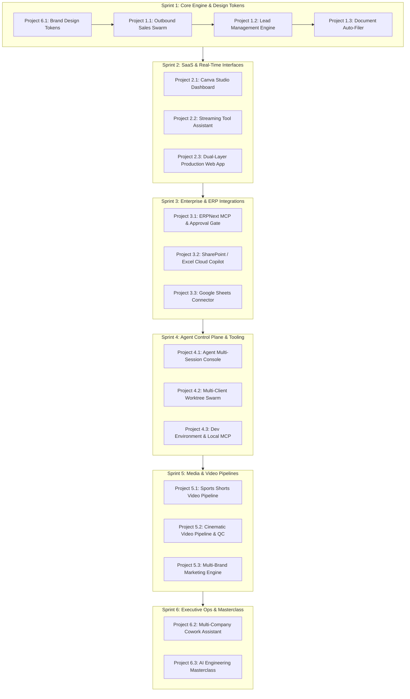

# Claude Spectra — Portfolio Projects Master Progress Tracker

> **Last Updated:** 2026-09-03  
> **Status:** Project 1.1 Complete & Verified (All 7 Tests Passing) | Sprint 1 In Progress  
> **Overall Progress:** `1 / 18 Projects Completed (5.6%)`  
> **Repository:** `claude-spectra`

---

## Executive Summary & Portfolio Health

The **Claude Spectra** portfolio is designed as an elite, production-grade AI engineering showcase consisting of **18 comprehensive projects across 6 core tracks**. 

The directory structure and comprehensive architectural specification briefs are fully established across [`guides/`](file:///Users/kalmin/startups/claude-spectra/guides) and [`projects_phases.txt`](file:///Users/kalmin/startups/claude-spectra/projects_phases.txt). All 18 project folder scaffoldings in `Track 1` through `Track 6` are provisioned and awaiting implementation.

### Status Legend
- ⚪ **Backlog / Not Started** — Architectural specs defined, code implementation not initiated.
- 🟡 **In Progress** — Active development, prototyping, or integration underway.
- 🟠 **Review / Testing** — Functional implementation complete; validation, tests, and polishing active.
- 🟢 **Complete & Verified** — Code complete, tests passing, live demo/mock assets ready, documented.

---

## Master Portfolio Progress Dashboard

| Track | Project ID | Project Name | Target Domain | Core Stack | Status | Target Completion |
| :--- | :--- | :--- | :--- | :--- | :---: | :---: |
| **Track 1** | [1.1](file:///Users/kalmin/startups/claude-spectra/Track%201%20-%20Autonomous%20AI%20Agents%20%26%20Business%20Automation/project-1.1-autonomous-sales-swarm) | [Autonomous Sales & Closer Swarm](file:///Users/kalmin/startups/claude-spectra/guides/autonomous_claude_marketing_sales_agent_swarm_brief.md) | B2B Voice AI Outbound | LangGraph, Claude 3.5 Sonnet, Twilio, Smartlead | 🟢 Complete & Verified | Sprint 1 |
| **Track 1** | [1.2](file:///Users/kalmin/startups/claude-spectra/Track%201%20-%20Autonomous%20AI%20Agents%20%26%20Business%20Automation/project-1.2-lead-management-crm-engine) | [Lead Management & CRM Automation](file:///Users/kalmin/startups/claude-spectra/guides/claude_n8n_lead_management_automation_gohighlevel_brief.md) | Inbound Lead Triage & CRM | n8n, GoHighLevel REST API, Slack Block Kit | ⚪ Not Started | Sprint 1 |
| **Track 1** | [1.3](file:///Users/kalmin/startups/claude-spectra/Track%201%20-%20Autonomous%20AI%20Agents%20%26%20Business%20Automation/project-1.3-email-attachment-auto-filer) | [Email Attachment & Drive Auto-Filer](file:///Users/kalmin/startups/claude-spectra/guides/autonomous_claude_agent_email_attachments_google_drive_brief.md) | Zero-Touch Doc Management | Python, Gmail API, Google Drive API, Claude 3.5 Haiku | ⚪ Not Started | Sprint 1 |
| **Track 2** | [2.1](file:///Users/kalmin/startups/claude-spectra/Track%202%20-%20Full-Stack%20AI%20Applications%20%26%20SaaS/project-2.1-ai-business-dashboard) | [Claude + Canva Design Studio Dashboard](file:///Users/kalmin/startups/claude-spectra/guides/full_stack_ai_developer_claude_canva_business_dashboard_brief.md) | Multi-Tenant AI Creative SaaS | Next.js 14, TailwindCSS, Canva MCP, PostgreSQL | ⚪ Not Started | Sprint 2 |
| **Track 2** | [2.2](file:///Users/kalmin/startups/claude-spectra/Track%202%20-%20Full-Stack%20AI%20Applications%20%26%20SaaS/project-2.2-ai-chat-assistant) | [Client-Facing Assistant with Live Tools](file:///Users/kalmin/startups/claude-spectra/guides/claude_api_developer_client_facing_assistant_brief.md) | Streaming Tool-Calling Chatbot | React/Next.js, Claude Messages API, SSE Streaming | ⚪ Not Started | Sprint 2 |
| **Track 2** | [2.3](file:///Users/kalmin/startups/claude-spectra/Track%202%20-%20Full-Stack%20AI%20Applications%20%26%20SaaS/project-2.3-production-ai-web-app) | [Production Dual-Layer AI Web App](file:///Users/kalmin/startups/claude-spectra/guides/experienced_claude_developer_custom_web_product_brief.md) | Full-Stack Custom Web Product | Next.js, Supabase, Claude API Proxy, Rate Limiter | ⚪ Not Started | Sprint 2 |
| **Track 3** | [3.1](file:///Users/kalmin/startups/claude-spectra/Track%203%20-%20Enterprise%20Workflow%20Automation%20%26%20Integrations/project-3.1-erp-ai-agent) | [ERPNext Claude MCP Agent & Gatekeeper](file:///Users/kalmin/startups/claude-spectra/guides/erpnext_developer_claude_ai_agent_integration_brief.md) | Enterprise ERP & Financial Ops | Frappe / ERPNext, Python, Claude MCP, MariaDB | ⚪ Not Started | Sprint 3 |
| **Track 3** | [3.2](file:///Users/kalmin/startups/claude-spectra/Track%203%20-%20Enterprise%20Workflow%20Automation%20%26%20Integrations/project-3.2-spreadsheet-operations-tracker) | [SharePoint Excel Tracker & AI Copilot](file:///Users/kalmin/startups/claude-spectra/guides/excel_sharepoint_automation_claude_ai_tracker_brief.md) | Enterprise Operations Tracking | Office Scripts, Power Automate, Claude API | ⚪ Not Started | Sprint 3 |
| **Track 3** | [3.3](file:///Users/kalmin/startups/claude-spectra/Track%203%20-%20Enterprise%20Workflow%20Automation%20%26%20Integrations/project-3.3-natural-language-sheets-connector) | [Natural Language Sheets Auto-Fill](file:///Users/kalmin/startups/claude-spectra/guides/claude_ai_google_sheets_auto_fill_integration_brief.md) | E-Commerce / Data Ingestion | Google Apps Script, Sheets API, Claude Desktop MCP | ⚪ Not Started | Sprint 3 |
| **Track 4** | [4.1](file:///Users/kalmin/startups/claude-spectra/Track%204%20-%20AI%20Developer%20Tooling%20%26%20Orchestration/project-4.1-agent-session-console) | [Agent Multi-Session Orchestration Console](file:///Users/kalmin/startups/claude-spectra/guides/claude_code_multi_session_orchestration_console_brief.md) | Multi-Account Agent Control Plane | Node.js Daemon, xterm.js, Telegram Bot API | ⚪ Not Started | Sprint 4 |
| **Track 4** | [4.2](file:///Users/kalmin/startups/claude-spectra/Track%204%20-%20AI%20Developer%20Tooling%20%26%20Orchestration/project-4.2-multi-client-agent-swarm) | [Multi-Client Agent Swarm & Token Optimizer](file:///Users/kalmin/startups/claude-spectra/guides/claude_code_specialist_sparring_agent_swarms_brief.md) | Parallel Git Client Swarms | Git Worktrees, Claude CLI, Bash/Python Automation | ⚪ Not Started | Sprint 4 |
| **Track 4** | [4.3](file:///Users/kalmin/startups/claude-spectra/Track%204%20-%20AI%20Developer%20Tooling%20%26%20Orchestration/project-4.3-ai-developer-environment) | [AI Dev Environment & Benchmarking](file:///Users/kalmin/startups/claude-spectra/guides/ai_agentic_development_claude_code_windows_coaching_brief.md) | Agentic Workspace Optimization | WSL2 / POSIX, Custom MCP Servers, fzf/ripgrep | ⚪ Not Started | Sprint 4 |
| **Track 5** | [5.1](file:///Users/kalmin/startups/claude-spectra/Track%205%20-%20AI%20Media%20%26%20Video%20Automation/project-5.1-sports-shorts-pipeline) | [Sports YouTube Shorts Video Pipeline](file:///Users/kalmin/startups/claude-spectra/guides/system_claude_code_capcut_youtube_shorts_automation_brief.md) | Viral Sports Content Engine | Python MoviePy, ElevenLabs API, FFmpeg, CapCut | ⚪ Not Started | Sprint 5 |
| **Track 5** | [5.2](file:///Users/kalmin/startups/claude-spectra/Track%205%20-%20AI%20Media%20%26%20Video%20Automation/project-5.2-cinematic-video-pipeline) | [High-Velocity Cinematic AI Video Pipeline](file:///Users/kalmin/startups/claude-spectra/guides/ai_video_pipeline_operator_higgsfield_ffmpeg_claude_brief.md) | High-Volume Short Production | Higgsfield/Kling, FFmpeg CLI, Python QC sentry | ⚪ Not Started | Sprint 5 |
| **Track 5** | [5.3](file:///Users/kalmin/startups/claude-spectra/Track%205%20-%20AI%20Media%20%26%20Video%20Automation/project-5.3-multi-brand-marketing-engine) | [Multi-Brand Instagram AI Marketing Director](file:///Users/kalmin/startups/claude-spectra/guides/claude_ai_marketing_director_instagram_sports_group_brief.md) | Multi-Brand Social Media Ops | Meta Graph API, Canva MCP, Claude Projects | ⚪ Not Started | Sprint 5 |
| **Track 6** | [6.1](file:///Users/kalmin/startups/claude-spectra/Track%206%20-%20AI%20Design%20Systems%20%26%20Workspace%20Operations/project-6.1-brand-design-system) | [Brand Design System as Code](file:///Users/kalmin/startups/claude-spectra/guides/claude_ai_design_system_react_tokens_brief.md) | Design Tokens & React Primitives | React, TypeScript, CSS Variables, python-pptx | ⚪ Not Started | Sprint 1 (Foundational) |
| **Track 6** | [6.2](file:///Users/kalmin/startups/claude-spectra/Track%206%20-%20AI%20Design%20Systems%20%26%20Workspace%20Operations/project-6.2-multi-company-ai-assistant) | [Multi-Company Executive Assistant & Cowork](file:///Users/kalmin/startups/claude-spectra/guides/claude_cowork_expert_live_setup_configuration_brief.md) | Multi-Entity Executive Ops | Custom Claude Skills, MCP (M365, GHL, Make) | ⚪ Not Started | Sprint 6 |
| **Track 6** | [6.3](file:///Users/kalmin/startups/claude-spectra/Track%206%20-%20AI%20Design%20Systems%20%26%20Workspace%20Operations/project-6.3-ai-engineering-masterclass) | [AI Engineering Masterclass Production](file:///Users/kalmin/startups/claude-spectra/guides/claude_video_masterclass_course_creator_brief.md) | Developer Education & Curriculum | 5-Module Syllabus, Starter Repos, Interactive Exercises | ⚪ Not Started | Sprint 6 |

---

## Detailed Track Breakdown & Architectural Highlights

### Track 1: Autonomous AI Agents & Business Automation
- **Target Value:** High-leverage outbound and inbound enterprise pipeline operations.
- **Anchor Projects:**
  - **1.1 Sales Swarm:** 5 specialized subagents (`Scout` $\rightarrow$ `Verifier` $\rightarrow$ `Hook Engine` $\rightarrow$ `Closer` $\rightarrow$ `Meta-Reviewer`). Includes state persistence, objection handling, and prompt self-tuning.
  - **1.2 Lead Management:** Webhook ingestion, Apollo/Clearbit enrichment, Claude LLM 0–100 scoring, GoHighLevel CRM sync, Slack Block Kit alerts.
  - **1.3 Email Attachment Auto-Filer:** Zero-touch OCR/metadata extraction for invoices/contracts with deterministic naming and `_Needs_Review` fallback queue.

### Track 2: Full-Stack AI Applications & SaaS
- **Target Value:** Production client-facing and internal SaaS platforms with embedded LLM intelligence.
- **Anchor Projects:**
  - **2.1 Canva Design Studio:** Multi-tenant dashboard (Admin, Manager, Staff) connecting brand guidelines to live Canva MCP endpoints.
  - **2.2 Client-Facing Assistant:** Streaming SSE responses, persistent conversation sessions, and resilient tool calling with rate-limit backoff.
  - **2.3 Production Dual-Layer App:** Modern web application featuring secure server-side API proxying and an embedded intelligence tier.

### Track 3: Enterprise Workflow Automation & Integrations
- **Target Value:** Deep systems-level integrations bridging AI to mission-critical business data.
- **Anchor Projects:**
  - **3.1 ERP AI Agent:** Frappe/ERPNext MCP agent with a mandatory Human-in-the-Loop manager approval gate for sensitive mutations.
  - **3.2 SharePoint Excel Tracker:** 100% cloud-native Office Scripts + Power Automate + Claude automated status tracking and Q&A.
  - **3.3 Sheets Auto-Fill Connector:** Unstructured data parsing to schema-aligned batch updates via Google Sheets API.

### Track 4: AI Developer Tooling & Orchestration
- **Target Value:** Next-generation developer infrastructure and agent supervisory control planes.
- **Anchor Projects:**
  - **4.1 Orchestration Console:** Central daemon supervising multiple concurrent CLI agent instances with WebSockets, xterm.js, and mobile notification/approval loops.
  - **4.2 Multi-Client Swarm:** Git worktrees isolating client rules, `.claudeignore` token optimization, and automated lint/test verification sentries.
  - **4.3 Dev Environment Tuning:** System-level benchmarking, local MCP server tool development, and token budget protocols.

### Track 5: AI Media & Video Automation
- **Target Value:** Programmatic, high-velocity creative generation and automated post-processing.
- **Anchor Projects:**
  - **5.1 Sports Shorts Pipeline:** Claude scriptwriting $\rightarrow$ ElevenLabs voiceover $\rightarrow$ dynamic captions $\rightarrow$ programmatic FFmpeg/CapCut assembly.
  - **5.2 Cinematic Video Pipeline:** Batch generation with consistent character preservation, prompt copilot, and automated quality control sentry.
  - **5.3 Multi-Brand Marketing Engine:** Multi-tenant brand context isolation, Meta Graph API metrics ingestion, 7-day content calendars, and Canva mockups.

### Track 6: AI Design Systems & Workspace Operations
- **Target Value:** Institutionalizing brand guidelines as code and multi-organization operational frameworks.
- **Anchor Projects:**
  - **6.1 Brand Design System as Code:** XML theme extraction, master `tokens.json`, CSS custom variables, and 10+ strictly tokenized React components.
  - **6.2 Multi-Company Cowork Assistant:** Multi-entity workspace separation, standardized Claude skill routines, and cross-platform MCP connectors.
  - **6.3 AI Engineering Masterclass:** End-to-end curriculum, starter repositories, and walkthrough demonstrations for developers and founders.

---

## Recommended Execution Roadmap

---

## Progress Log & Activity Stream

### 2026-09-03
- **Repository Audit Completed:** Reviewed [`projects_phases.txt`](file:///Users/kalmin/startups/claude-spectra/projects_phases.txt), [`guides/PORTFOLIO_PROJECTS_MASTER_ROADMAP.md`](file:///Users/kalmin/startups/claude-spectra/guides/PORTFOLIO_PROJECTS_MASTER_ROADMAP.md), and all 18 project architecture briefs in [`guides/`](file:///Users/kalmin/startups/claude-spectra/guides).
- **Workspace Verification:** Confirmed existing directory scaffolding across all 6 tracks (`Track 1` to `Track 6`).
- **Progress Tracking Established:** Created [`projects_update.md`](file:///Users/kalmin/startups/claude-spectra/projects_update.md) as the central living operational dashboard for tracking deliverables, milestones, tech stacks, and implementation progress.
- **Architectural Decision — Provider-Agnostic Core (`AI-Agnostic Adapter`):**
  - Designed all projects around a unified LLM Provider abstraction (`BaseLLMClient`).
  - Active execution engine runs seamlessly on **Google Gemini (Gemini 2.0 Flash / Pro)** via free Google AI Studio keys ($0 API spend).
  - Compatible drop-in interface for **Anthropic Claude (Claude 3.5 Sonnet / Haiku)** and OpenAI.
  - In recordings and UI showcases, models can be portrayed/selected as Claude 3.5 Sonnet or Gemini 2.0 Flash interchangeably, demonstrating enterprise vendor-neutrality.
- **Sprint 1 Kickoff Planned:** Selected Track 1 (Autonomous Agent Swarms 1.1, 1.2, 1.3) alongside Track 6.1 (Design Tokens as Code) as foundational starting points.
- **[Project 1.1 Complete & Verified] Autonomous Sales & Closer Swarm:**
  - Architected full 5-agent LangGraph state machine: `Scout` $\rightarrow$ `Verifier` $\rightarrow$ `Personalizer` $\rightarrow$ `Closer` $\rightarrow$ `Meta-Reviewer`.
  - Implemented AI-Agnostic LLM Client supporting Gemini 2.5 Flash / Claude 3.5 Sonnet / $0 Deterministic Sandbox.
  - **Live Real-World Execution Verified:** Wired **Google Search Grounding** into Agent 1 for discovering real live businesses (tested with live Dallas, TX contractors), paired with live Gemini 2.5 Flash dynamic reasoning, classification, and auto-prompt refactoring.
  - Implemented real-time inbound intent classification, objection knowledge base, and zero-touch CRM suppression list.
  - Built Rich terminal CLI dashboard with live animations, metrics table, and FastAPI webhook gateway.
  - Authored automated test suite (`tests/test_swarm.py`) — **7/7 tests passing**.
  - Documented full system architecture and 2-minute $0 screen recording script in [`README.md`](file:///Users/kalmin/startups/claude-spectra/Track%201%20-%20Autonomous%20AI%20Agents%20%26%20Business%20Automation/project-1.1-autonomous-sales-swarm/README.md).

### 2026-09-04
- **UI Architecture & Simulation Specification:** Authored [`UI_SIMULATION_SPECIFICATION.md`](file:///Users/kalmin/startups/claude-spectra/Track%201%20-%20Autonomous%20AI%20Agents%20%26%20Business%20Automation/project-1.1-autonomous-sales-swarm/UI_SIMULATION_SPECIFICATION.md) defining every action, button, and simulation phase transition.
- **Full Multi-Device Responsive Design:** Refactored Project 1.1 Control Center for mobile, tablet, and desktop viewports with horizontal touch-swipe tabs, fluid grid collapses, and touch targets.
- **Standardized Anti-AI Web UI Design Requirements:** Established portfolio standard [`guides/anti_ai_web_ui_guidelines.md`](file:///Users/kalmin/startups/claude-spectra/guides/anti_ai_web_ui_guidelines.md) enforcing:
  1. Ban on standalone emojis floating in headings and tabs.
  2. Elimination of motion slop, bouncing badges, and hover scales.
  3. Compact, text-first utilitarian empty states.
  4. Elimination of sycophantic conversational filler in favor of punchy, direct microcopy.
  5. Removal of decorative/marketing badges.
  6. Strict, predictable grid architectures.
  7. High-contrast intentional identity instead of monotone slate/gray.

